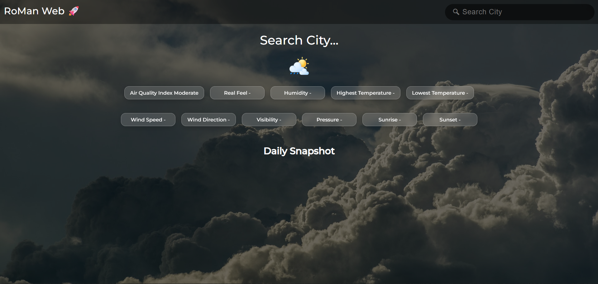
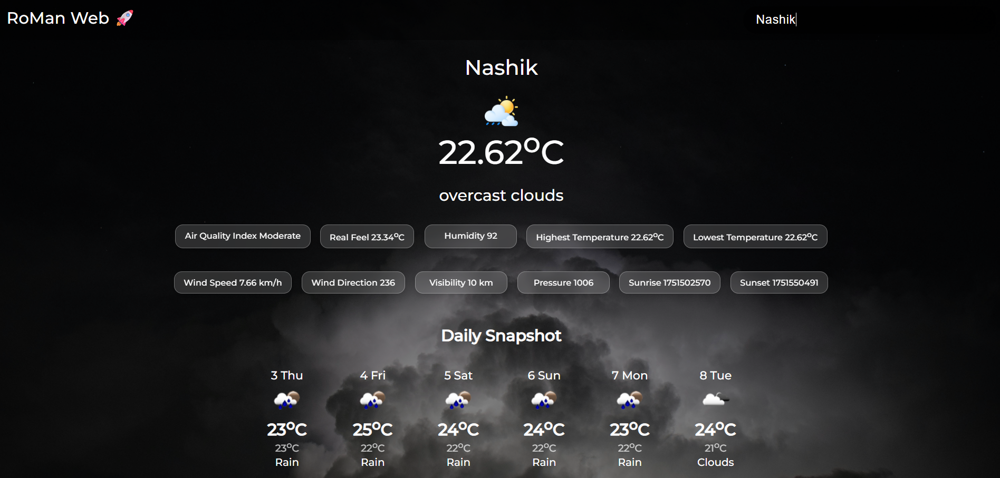
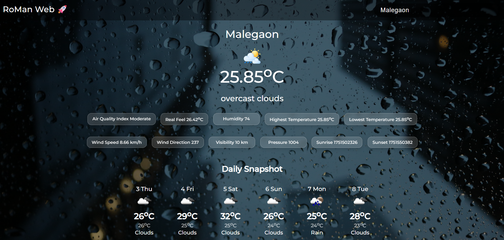
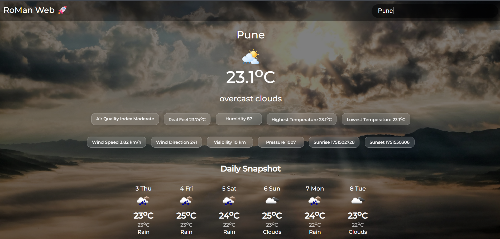

# Weather App using OpenWeatherMap API
A weather app made using OpenWeatherMap API in Vanilla JavaScript.

The app tells the current temperature and some additional information like Air Quality Index, Real Feel, Humidity, Highest Temperature, Lowest Temperature, Wind Speed, Wind Direction, Visibility, Pressure, Sunrise and Sunset.

Visit Website --> [WeatherAppUsingOpenWeatherMapAPI](https://kshitizrohilla.github.io/weather-app-using-openweathermap-api)

## Screenshots
  
  
  

## 🌐 Live Demo
[Click here to view the Weather App](https://iamro045.github.io/Weather-App/)
